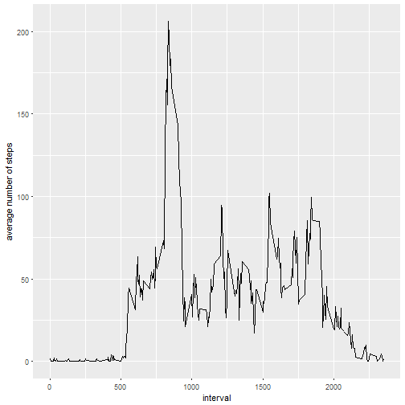
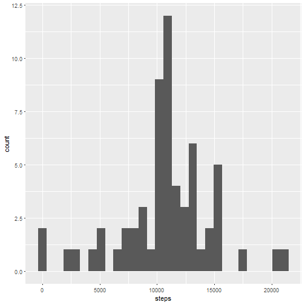

Two R packages will be used dplyr and ggplot2

```r
library(dplyr)
library(ggplot2)
```

## Loading and preprocessing the data
The data is in csv format. The type for date and steps variables need to be set as date and numeric.


```r
df <- read.csv("activity.csv")
df$date <- as.Date(df$date)
df$steps <- as.numeric(df$steps)
```

## What is mean total number of steps taken per day?
The following plot presents a histogram of total number of steps per day (missing values ignored).

```r
total_steps_per_day <- df %>% group_by(date) %>% 
                              summarize(steps = sum(steps, na.rm=TRUE))
qplot(steps, data=total_steps_per_day, geom="histogram")
```


Mean and median of those values are respectively:

```r
mean(total_steps_per_day$steps)
```

```
## [1] 9354.23
```

```r
median(total_steps_per_day$steps)
```

```
## [1] 10395
```

## What is the average daily activity pattern?
The following plot presents a daily activity pattern of the subject i.e. her average number of steps during the day.

```r
daily_steps <- df %>% group_by(interval) %>% 
                      summarize(avg_steps = mean(steps, na.rm=TRUE))
qplot(x=interval, y=avg_steps, data=daily_steps, geom="line") + labs(y="average number of steps")
```



The maximum number of steps (a spike in daily activity) falls into the interval :

```r
unlist(daily_steps[which.max(daily_steps$avg_steps), "interval"])
```

```
## interval 
##      835
```

## Imputing missing values
In the datasets there is the following number of missing  values:

```r
missing <- is.na(df$steps)
sum(missing)
```

```
## [1] 2304
```

They will be replaced with the average for the given time interval across all days.

```r
df2 <- merge(df, daily_steps, by="interval") %>%
       mutate(steps = ifelse(is.na(steps), avg_steps, steps)) %>%
       select(date, interval, steps) %>%
       arrange(date, interval)
```

With missing values filled in, the distribution of total number of steps per day is now:

```r
total_steps_per_day2 <- df2 %>% group_by(date) %>% summarize(steps = sum(steps))
qplot(steps, data=total_steps_per_day2, geom="histogram")
```



The mean and median of those values are respectively:

```r
mean(total_steps_per_day2$steps)
```

```
## [1] 10766.19
```

```r
median(total_steps_per_day2$steps)
```

```
## [1] 10766.19
```

Both mean and median increased after imputing the missing values and the distribution became more symmetrical.

## Are there differences in activity patterns between weekdays and weekends?
The following plot presents average daily activity pattern for weekdays vs weekends.

```r
daily_steps2 <- df2 %>% mutate(day = ifelse(weekdays(df2$date) %in% c("Saturday", "Sunday"), "weekend", "weekday")) %>%
                group_by(day, interval) %>% 
                summarize(avg_steps = mean(steps))

qplot(x=interval, y=avg_steps, data=daily_steps2, facets=day~., geom="line") + labs(y="average number of steps")
```


The spike of activity occurs around the same time in the morning on weekdays and on weekends, but in the latter case it is less pronounced, as the activity seems to be much more evenly distributed during the day. Also during weekends activity starts and fades a bit later than during the weekdays. 
